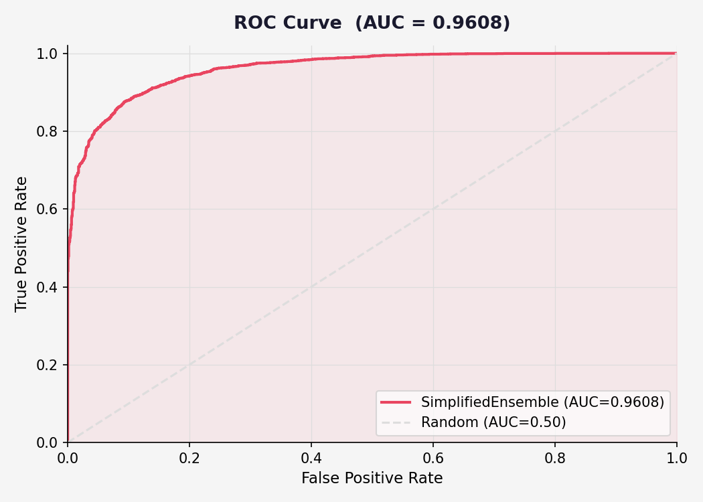
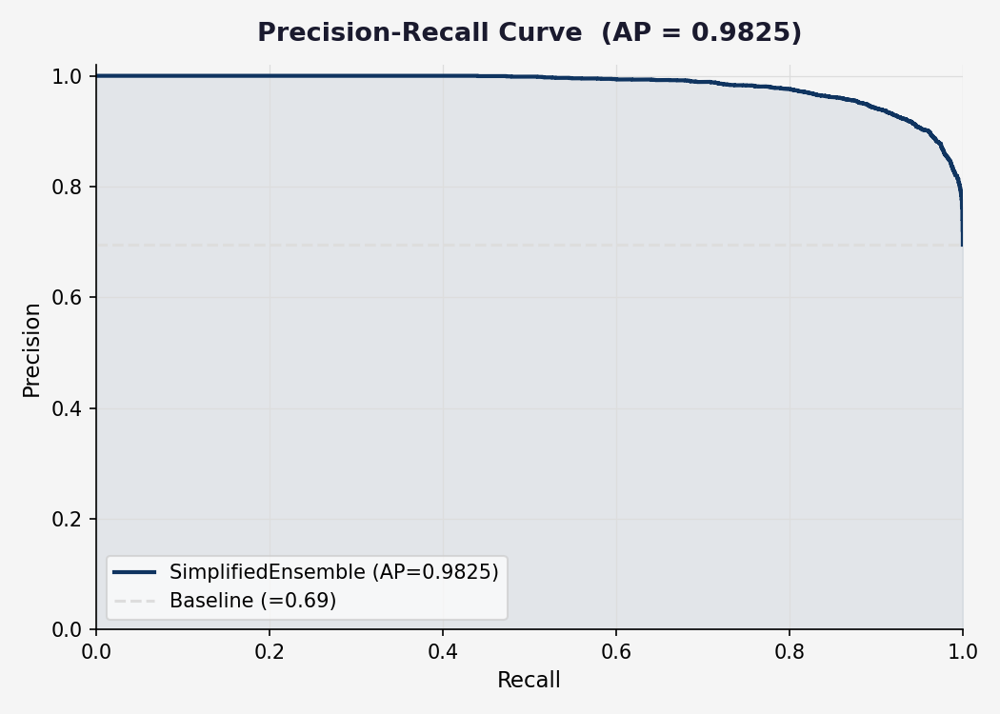
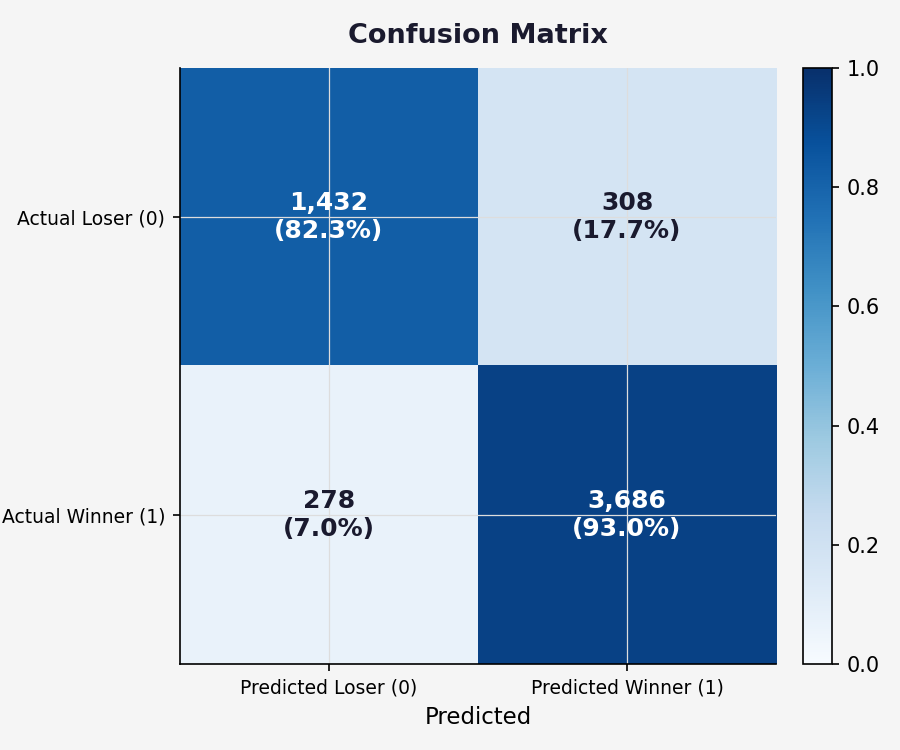
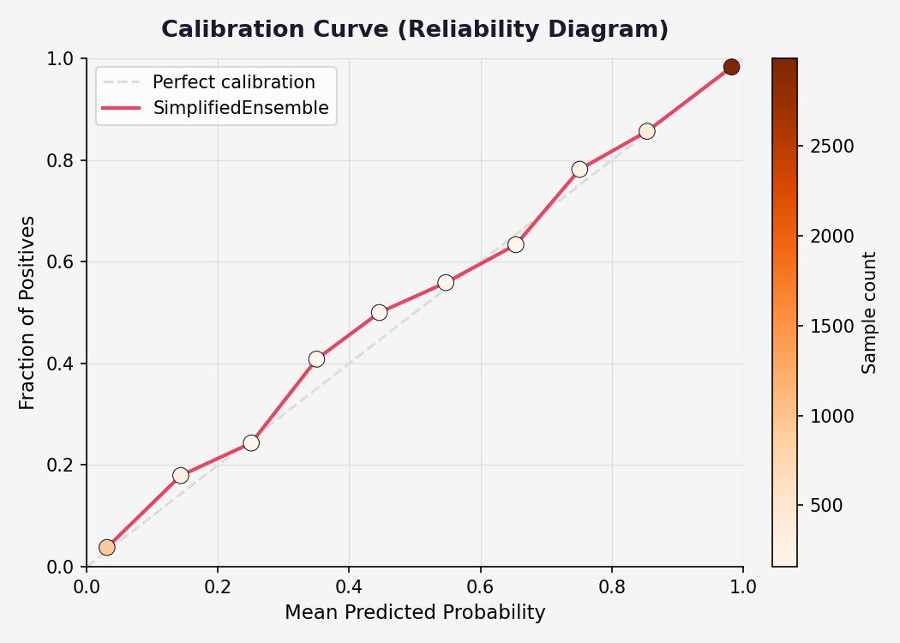
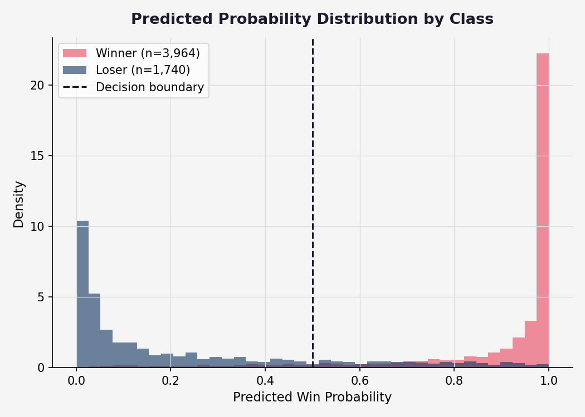
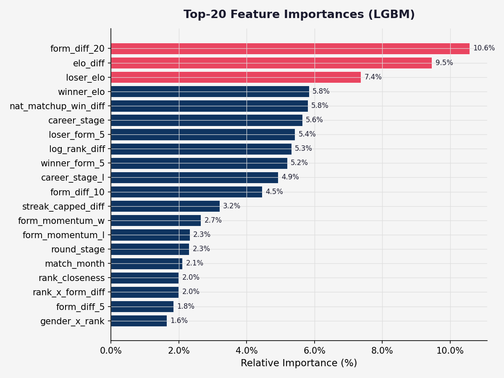
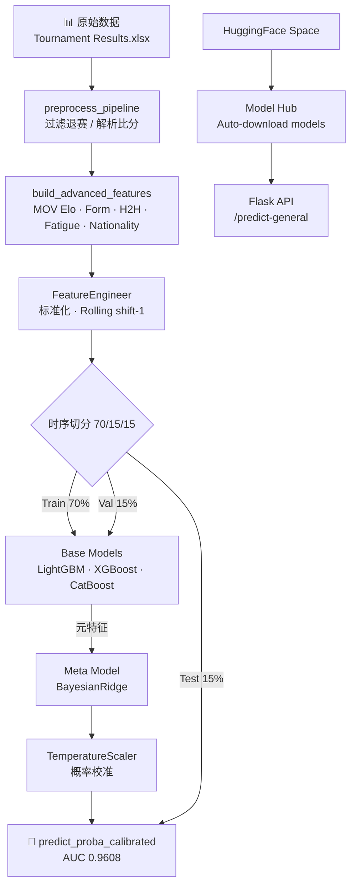

<div align="center">

# 🏸 Happy Badminton

**羽毛球比赛胜负概率预测系统**

[](README.md)
[](README.md)
[](README.md)
[](README.md)
[](README.md)
[](https://huggingface.co/spaces/owenlee-5678/happy-badminton)

*基于 GBM Stacking Ensemble — LightGBM + XGBoost + CatBoost + BayesianRidge 元学习 + TemperatureScaler 校准*

[English README](README_en.md) · [快速开始](#快速开始) · [模型性能](#模型性能) · [致谢](#致谢)

</div>

---

## 快速开始

### 方式一：本地运行

```bash
uv sync                   # 安装依赖
uv run python main.py     # 自动训练（首次约 3–5 分钟）后启动服务
# 访问 http://localhost:5001
```

### 方式二：HuggingFace Space

直接访问 [**Happy Badminton Space**](https://huggingface.co/spaces/owenlee-5678/happy-badminton) 使用在线版本，无需安装任何依赖。

模型文件托管在 [**HuggingFace Model Hub**](https://huggingface.co/owenlee-5678/happy-badminton-models)，Space 会自动下载。

<details>
<summary>更多命令</summary>

```bash
uv run python main.py --train      # 强制重新训练
uv run python main.py --port 8080  # 自定义端口
./run.sh                           # Shell 快捷方式（Mac/Linux）

# 单独训练 / 验证
uv run python scripts/train_simplified.py   # 训练
uv run python scripts/validate_model.py     # 在测试集上验证
uv run python scripts/optimize_sota.py      # Optuna 超参搜索（可选）

# 质量检查
uv run ruff check . && uv run ruff format . && uv run pytest tests/ -v
```

</details>

---

## 模型性能

<div align="center">

| 指标 | 数值 |
|:----:|:----:|
| 🎯 **ROC AUC** | **0.9608** |
| 📉 LogLoss | 0.2316 |
| 📐 Brier Score | 0.0722 |
| ✅ Accuracy | 89.7% |
| 🏆 Winner Recall | 93.0% |
| 🔍 Upset Detection | 82.3% |

*测试集 5,704 场 · 时序切分 70/15/15*

</div>

### 评估图表

<table align="center">
<tr>
<td align="center"><br><b>ROC 曲线</b><br><sub>AUC=0.9608，远超随机基线</sub></td>
<td align="center"><br><b>Precision-Recall 曲线</b><br><sub>高精度与高召回率并存</sub></td>
</tr>
<tr>
<td align="center"><br><b>混淆矩阵</b><br><sub>赢家识别 93.0%，爆冷识别 82.3%</sub></td>
<td align="center"><br><b>校准曲线</b><br><sub>概率预测高度准确，紧贴对角线</sub></td>
</tr>
<tr>
<td align="center"><br><b>概率分布</b><br><sub>赢家/输家两峰清晰分离</sub></td>
<td align="center"><br><b>特征重要性 Top 20</b><br><sub>ELO 差值与近期状态是最强信号</sub></td>
</tr>
</table>

---

## 架构



**部署架构**：
- 📦 **Model Hub**: `owenlee-5678/happy-badminton-models` 存储训练好的模型文件
- 🚀 **Space**: Docker 容器自动从 Model Hub 下载模型并启动 API
- 🔄 **CI/CD**: GitHub Actions 在每次 push 时自动同步代码到 Space

---

## 预测前端

访问 `http://localhost:5001`，输入赛前可知数据即可获得预测。

| 模式 | 输入 | 适合场景 |
|------|------|---------|
| ⚡ **Quick** | 排名、ELO、国籍、赛事级别、轮次、主场 | 快速判断，30 秒出结果 |
| 🔬 **Expert** | 所有字段必填：排名、ELO、国籍、赛事级别、轮次、举办国、近况（5/10/20场）、H2H、连胜/败、生涯场次、三局比例 | 最高精度 |

数据查询推荐：[BadmintonRanks.com](https://badmintonranks.com)

---

## 35 个赛前特征

<details>
<summary>展开查看完整特征列表</summary>

| 类别 | 特征 |
|------|------|
| 📊 排名 | `log_rank_diff`, `rank_closeness` |
| 🏟️ 比赛环境 | `category_flag`, `level_numeric`, `round_stage`, `match_month` |
| 🏠 主场优势 | `winner_home`, `loser_home`, `level_x_home`, `home_x_closeness` |
| 📈 近期状态 | `winner_form_5`, `loser_form_5`, `form_diff_5/10/20` |
| ⚡ 动量 | `form_momentum_w`, `form_momentum_l`, `momentum_diff` |
| 🔥 连胜（封顶±5） | `streak_capped_w`, `streak_capped_l`, `streak_capped_diff` |
| ⚔️ H2H | `h2h_win_rate_bayes`（贝叶斯平滑） |
| 🎖️ 经验 | `career_stage`, `career_stage_l`（U 型曲线） |
| 🔗 交互特征 | `rank_x_form_diff`, `rank_closeness_x_h2h`, `gender_x_rank` |
| 🌏 国籍 | `same_nationality`, `nat_matchup_win_diff` |
| 🌐 洲际主场 | `winner_continent_home`, `loser_continent_home`, `continent_advantage_diff` |
| 📡 ELO | `winner_elo`, `loser_elo`, `elo_diff` |

</details>

---

## 文件结构

<details>
<summary>展开查看</summary>

```
Happy-Badminton/
├── main.py                        # 一键入口（自动训练 + 启动）
├── config.yaml                    # 超参数（单一数据源）
├── data/raw/
│   ├── Tournament Results.xlsx    # 真实数据（gitignored）
│   └── Tournament Results - Sample.xlsx  # 示例数据（20 场）
├── src/
│   ├── data/
│   │   ├── loader.py              # 数据加载与合并
│   │   ├── preprocessor.py        # 清洗、异常值处理
│   │   ├── advanced_features.py   # MOVEloRating · MomentumFeatures · H2H · Nationality
│   │   └── feature_engineering.py # 标准化 · Rolling（全部 shift(1)）
│   ├── models/
│   │   └── ensemble_models.py     # StackingEnsemble + TemperatureScaler
│   └── utils/
│       └── constants.py           # LEAK_FEATURES · LEVEL_MAP（单一数据源）
├── scripts/
│   ├── train_simplified.py        # 训练通用预测模型
│   ├── validate_model.py          # 测试集验证
│   └── generate_eval_plots.py     # 生成评估图表
├── frontend/
│   ├── app.py                     # Flask API
│   ├── templates/index.html       # 4-view SPA
│   └── static/                    # JS · CSS · SVG
├── models/                        # 训练产物（gitignored）
└── tests/                         # 180+ pytest 测试
```

</details>

---

## 数据概况

| 项目 | 数值 |
|------|------|
| 📅 时间范围 | 2022-01-11 至 2025-01-16 |
| 🎾 比赛场数 | 38,024 场（过滤退赛后） |
| 👤 球员数 | 5,293 人 |
| 🏆 赛事级别 | OG · WC · WTF · S1000 · S750 · S500 · S300 · S100 · IS · IC |

---

## 致谢

<div align="center">

**本项目的数据完全来自 [BadmintonRanks.com](https://badmintonranks.com/)**

非常感谢 BadmintonRanks.com 的 owner 慷慨授权使用数据库用于这个研究项目。
没有这份数据，一切都不可能实现。如果你也在做羽毛球数据分析，
[BadmintonRanks.com](https://badmintonranks.com) 是你最好的起点。🙏

</div>

---

<div align="center">

MIT License · Made with ❤️ and a lot of shuttlecocks

</div>
