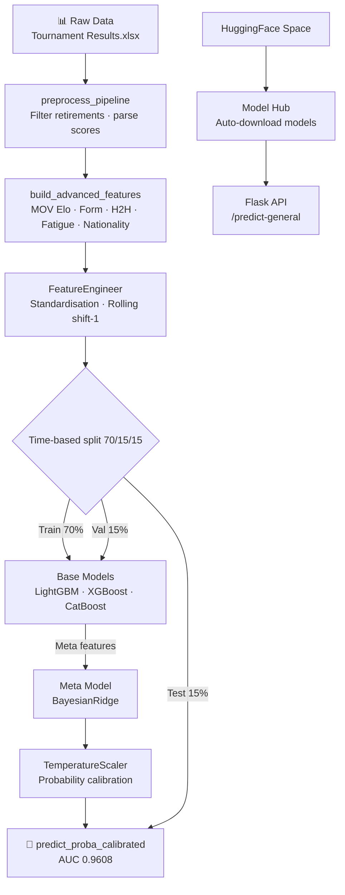

<div align="center">

# 🏸 Happy Badminton

**Badminton match win-probability predictor**

[](README.md)
[](README.md)
[](README.md)
[](README.md)
[](README.md)
[](https://huggingface.co/spaces/owenlee-5678/happy-badminton)

*GBM Stacking Ensemble — LightGBM + XGBoost + CatBoost + BayesianRidge meta-learner + TemperatureScaler calibration*

**[中文版 README](README_zh.md)** | [Quick Start](#quick-start) | [Performance](#model-performance) | [Acknowledgements](#acknowledgements)

</div>

---

## Quick Start

### Option 1: Local

```bash
uv sync                   # Install dependencies
uv run python main.py     # Auto-train on first run (~3–5 min), then start server
# Open http://localhost:5001
```

### Option 2: HuggingFace Space

Visit the [**Happy Badminton Space**](https://huggingface.co/spaces/owenlee-5678/happy-badminton) for the online version — no installation required.

Models are hosted on the [**HuggingFace Model Hub**](https://huggingface.co/owenlee-5678/happy-badminton-models) and auto-downloaded by the Space.

<details>
<summary>More commands</summary>

```bash
uv run python main.py --train      # Force re-train
uv run python main.py --port 8080  # Custom port
./run.sh                           # Shell shortcut (Mac/Linux)

# Train / validate standalone
uv run python scripts/train_simplified.py
uv run python scripts/validate_model.py
uv run python scripts/optimize_sota.py      # Optuna hyperparameter search (optional)

# Quality gate
uv run ruff check . && uv run ruff format . && uv run pytest tests/ -v
```

</details>

---

## Model Performance

<div align="center">

### Expert Mode (35 features)

| Metric | Value |
|:------:|:-----:|
| 🎯 **ROC AUC** | **0.9608** |
| 📉 LogLoss | 0.2316 |
| 📐 Brier Score | 0.0722 |
| ✅ Accuracy | 89.7% |
| 🏆 Winner Recall | 93.0% |
| 🔍 Upset Detection | 82.3% |

*Test set: 5,704 matches · Time-based split 70/15/15*

### Quick Mode (21 features)

| Metric | Value |
|:------:|:-----:|
| 🎯 **ROC AUC** | **0.8703** |
| 📉 LogLoss | 0.4247 |
| 📐 Brier Score | 0.1320 |
| ✅ Accuracy | 81.0% |

*Test set: 5,704 matches · No form/streak/career data required*

**Mode Selection**:
- ⚡ **Quick**: Only ranking, ELO, nationality, tournament info → 30 seconds (AUC 0.87)
- 🔬 **Expert**: Full data including recent form → Highest accuracy (AUC 0.96)

</div>

### Evaluation Charts

<table align="center">
<tr>
<td align="center"><br><b>ROC Curve</b><br><sub>AUC=0.9608, far above the random baseline</sub></td>
<td align="center"><br><b>Precision-Recall Curve</b><br><sub>High precision and recall simultaneously</sub></td>
</tr>
<tr>
<td align="center"><br><b>Confusion Matrix</b><br><sub>Winner recall 93.0%, upset detection 82.3%</sub></td>
<td align="center"><br><b>Calibration Curve</b><br><sub>Predicted probabilities closely track actual win rates</sub></td>
</tr>
<tr>
<td align="center"><br><b>Score Distribution</b><br><sub>Two clearly separated peaks for winners and losers</sub></td>
<td align="center"><br><b>Feature Importance Top 20</b><br><sub>ELO difference and recent form are the strongest signals</sub></td>
</tr>
</table>

---

## Architecture



**Deployment Architecture**:
- 📦 **Model Hub**: `owenlee-5678/happy-badminton-models` stores trained model files
- 🚀 **Space**: Docker container auto-downloads models from Hub and starts API
- 🔄 **CI/CD**: GitHub Actions syncs code to Space on every push

---

## Frontend Predictor

Visit `http://localhost:5001` and enter pre-match stats to get a prediction.

| Mode | Inputs | Features | Model | Performance | Best for |
|------|--------|----------|-------|-------------|----------|
| ⚡ **Quick** | Ranking, ELO, nationality, tournament level, round, home ground | 21 | QuickEnsemble | AUC 0.87, Acc 81% | Fast judgement, 30 seconds |
| 🔬 **Expert** | All Quick fields + form (5/10/20), H2H, streak, career matches, 3-set rate | 35 | SimplifiedEnsemble | AUC 0.96, Acc 90% | Maximum accuracy |

**Important**: ELO is **required** in both modes (top 3 feature importance at 9.5%).

**Data sources**:
- **All data available from [BadmintonRanks.com](https://badmintonranks.com)**
- Rankings: Player page → Profile tab (shows current ranking)
- ELO Rating: Player page → Match Details tab
- Recent form (5/10/20 matches): Player page → Match Details tab
- Streaks: Player page → Winning Streak tab
- Head-to-head (H2H): Player page → Head-to-Head tab
- Career matches: Player page → Profile tab (shows total wins-losses, e.g., "453-81")

---

## Feature Sets

<details>
<summary><b>Expert Mode: 35 features</b></summary>

| Category | Features |
|----------|----------|
| 📊 Ranking | `log_rank_diff`, `rank_closeness` |
| 🏟️ Match context | `category_flag`, `level_numeric`, `round_stage`, `match_month` |
| 🏠 Home advantage | `winner_home`, `loser_home`, `level_x_home`, `home_x_closeness` |
| 📈 Recent form | `winner_form_5`, `loser_form_5`, `form_diff_5/10/20` |
| ⚡ Momentum | `form_momentum_w`, `form_momentum_l`, `momentum_diff` |
| 🔥 Streak (capped ±5) | `streak_capped_w`, `streak_capped_l`, `streak_capped_diff` |
| ⚔️ H2H | `h2h_win_rate_bayes` (Bayesian-smoothed) |
| 🎖️ Experience | `career_stage`, `career_stage_l` (U-curve) |
| 🔗 Interactions | `rank_x_form_diff`, `rank_closeness_x_h2h`, `gender_x_rank` |
| 🌏 Nationality | `same_nationality`, `nat_matchup_win_diff` |
| 🌐 Continental home | `winner_continent_home`, `loser_continent_home`, `continent_advantage_diff` |
| 📡 ELO | `winner_elo`, `loser_elo`, `elo_diff` |

</details>

<details>
<summary><b>Quick Mode: 21 features (subset of Expert)</b></summary>

Quick mode uses only:
- All ranking, match context, home advantage features
- H2H (Bayesian-smoothed)
- Nationality and continental home features
- **ELO features** (winner_elo, loser_elo, elo_diff)

Quick mode **excludes**:
- Recent form (form_5/10/20)
- Momentum features
- Streak features
- Career stage
- Feature interactions

</details>

---

## Legacy: Full 35 Feature List (Expert Mode)

<details>
<summary>Expand full feature list</summary>

| Category | Features |
|----------|----------|
| 📊 Ranking | `log_rank_diff`, `rank_closeness` |
| 🏟️ Match context | `category_flag`, `level_numeric`, `round_stage`, `match_month` |
| 🏠 Home advantage | `winner_home`, `loser_home`, `level_x_home`, `home_x_closeness` |
| 📈 Recent form | `winner_form_5`, `loser_form_5`, `form_diff_5/10/20` |
| ⚡ Momentum | `form_momentum_w`, `form_momentum_l`, `momentum_diff` |
| 🔥 Streak (capped ±5) | `streak_capped_w`, `streak_capped_l`, `streak_capped_diff` |
| ⚔️ H2H | `h2h_win_rate_bayes` (Bayesian-smoothed) |
| 🎖️ Experience | `career_stage`, `career_stage_l` (U-curve) |
| 🔗 Interactions | `rank_x_form_diff`, `rank_closeness_x_h2h`, `gender_x_rank` |
| 🌏 Nationality | `same_nationality`, `nat_matchup_win_diff` |
| 🌐 Continental home | `winner_continent_home`, `loser_continent_home`, `continent_advantage_diff` |
| 📡 ELO | `winner_elo`, `loser_elo`, `elo_diff` |

</details>

---

## File Structure

<details>
<summary>Expand</summary>

```
Happy-Badminton/
├── main.py                        # One-click entry (auto-train + start)
├── config.yaml                    # All hyperparameters (single source of truth)
├── data/raw/
│   ├── Tournament Results.xlsx    # Full data (gitignored)
│   └── Tournament Results - Sample.xlsx  # 20-match sample
├── src/
│   ├── data/
│   │   ├── loader.py              # Excel loading & merging
│   │   ├── preprocessor.py        # Cleaning & outlier handling
│   │   ├── advanced_features.py   # MOVEloRating · MomentumFeatures · H2H · Nationality
│   │   └── feature_engineering.py # Standardisation · Rolling (all shift(1))
│   ├── models/
│   │   └── ensemble_models.py     # StackingEnsemble + TemperatureScaler
│   └── utils/
│       └── constants.py           # LEAK_FEATURES · LEVEL_MAP (single source of truth)
├── scripts/
│   ├── train_simplified.py        # Train Expert mode model (35 features)
│   ├── train_quick.py             # Train Quick mode model (21 features)
│   ├── validate_model.py          # Test-set evaluation
│   └── generate_eval_plots.py     # Generate evaluation charts
├── frontend/
│   ├── app.py                     # Flask API
│   ├── templates/index.html       # 4-view SPA
│   └── static/                    # JS · CSS · SVG
├── models/                        # Trained artefacts (gitignored)
└── tests/                         # 216 pytest tests
```

</details>

---

## Dataset

| Field | Value |
|-------|-------|
| 📅 Date range | 2022-01-11 to 2025-01-16 |
| 🎾 Matches | 38,024 (after filtering retirements) |
| 👤 Players | 5,293 |
| 🏆 Levels | OG · WC · WTF · S1000 · S750 · S500 · S300 · S100 · IS · IC |

---

## Acknowledgements

<div align="center">

**Match data provided by [BadmintonRanks.com](https://badmintonranks.com/)**

A huge thank you to the owner of BadmintonRanks.com for generously granting permission
to use their database for this research project.
BadmintonRanks.com provides complete match records (scores, matchups, tournament levels, etc.),
and this project calculates MOV ELO ratings and all advanced features on top of that.
</div>

---

<div align="center">

MIT License · Made with ❤️ and a lot of shuttlecocks

</div>
